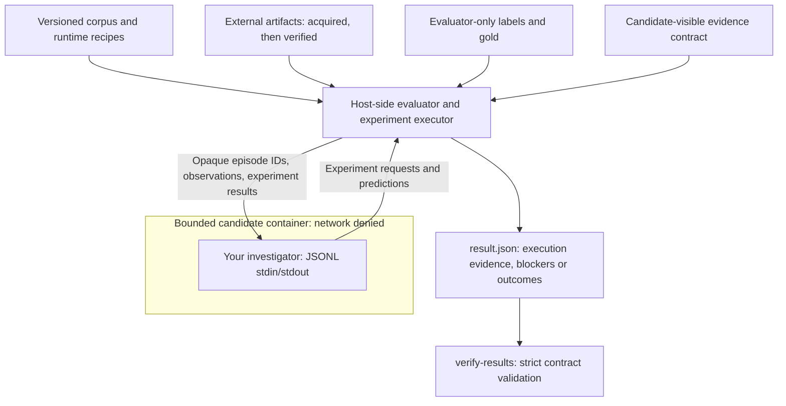

# Radar Bench

[](https://github.com/Smkzz/radar-bench/actions/workflows/ci.yml)
[](https://github.com/Smkzz/radar-bench/releases/latest)
[](pyproject.toml)
[](LICENSE)
[](DATA_LICENSE.md)

**An executable benchmark for reproducible software failure attribution.**
Radar Bench tests whether an investigator can distinguish a failure caused by a
proposed change from a dependency, packaging, platform, resolver,
nondeterministic, or external-resource failure. A failed run is evidence to
investigate, not proof that the proposed change caused it.

For researchers evaluating investigation methods and engineers testing failure
triage, Radar provides a small, inspectable benchmark with explicit execution
and evidence boundaries. It is **not an attribution agent or an automatic fix
service**. The original autonomous-attribution product failed validation; this
repository preserves that negative result rather than presenting it as success.

## What you get / what you don't get

| What you get | What you don't get |
| --- | --- |
| 25 executable cases, strict result validation, and reproducibility receipts | A production-ready investigator, automatic fixes, or a hosted inference API |
| Separate candidate-visible observations and evaluator-owned reference answers | Hidden tests or protection against someone memorizing the public answers |
| Frozen baselines, explicit blockers, and an auditable negative research result | Broad accuracy claims, population estimates, or cross-ecosystem validation |

The current suite, **`decisive-v1.2`**, is the benchmark's versioned evaluation
protocol, not the Python package version. It contains five historical cases and
20 constructed **safety twins**: controlled failure scenarios used to test
whether an investigator wrongly blames the proposed change. The **candidate**
is the investigator being evaluated; the **evaluator** owns scoring and **gold**
(the reference answers). See [BENCHMARK.md](BENCHMARK.md) for the protocol and
[the limitations](docs/LIMITATIONS.md) before interpreting a score.

## Versions and compatibility

**Package release: 1.1.1. Current suite: decisive-v1.2.** These versions identify
different artifacts and intentionally do not have to match.

| Identifier | Current value | Meaning |
| --- | --- | --- |
| Python package and release tag | `1.1.1` / `v1.1.1` | Installable CLI, packaging, and release engineering; matches `pyproject.toml`, `radar-bench --version`, and `CITATION.cff` |
| Current benchmark suite | `decisive-v1.2` | Candidate/evaluator separation and the external `1.2-jsonl` protocol |
| Current suite contract | `1.1.0` | Immutable corpus contract; also the v1.2 result's `release_version`, not the installed package version |
| Historical reference suite | `decisive-v1.1` | Preserved regression contract, cases, baselines, and original negative conclusion |

`radar-bench list-suites` reports package and suite-contract versions separately.
The v1.2 protocol adds opaque per-run episode IDs, fail-closed external JSONL
input, fresh experiment accounting, and candidate/evaluator separation. It does
not change the cases, labels, gold, scoring, or frozen baseline behavior.
Documentation improvements on `main` do not rewrite published tags or assets.
Use the exact tag and matching release assets for scientific reproduction.

## Try it: install, write a result, verify it

**Requirements:** Python 3.11–3.13. The commands below use a Linux/WSL shell,
`curl`, and `sha256sum`. This first example needs **no Docker, candidate image,
API key, or external benchmark artifacts**. Network access is used only to
download the wheel; installation and the smoke evaluation below are offline.

### 1. Install the verified release wheel

Run in a new directory, **outside any Radar source checkout**. The digest below
is for the published v1.1.1 wheel, not a wheel rebuilt from today's `main`.

```sh
mkdir radar-demo
cd radar-demo
curl --fail --location --output radar_bench-1.1.1-py3-none-any.whl \
  https://github.com/Smkzz/radar-bench/releases/download/v1.1.1/radar_bench-1.1.1-py3-none-any.whl
printf '%s  %s\n' \
  24895de5cc8202a595a0a541188b93d389b5df848787fab2e1ddfe7423118240 \
  radar_bench-1.1.1-py3-none-any.whl | sha256sum --check --strict
python3 -m venv .venv
.venv/bin/python -m pip install --no-index --no-deps ./radar_bench-1.1.1-py3-none-any.whl
.venv/bin/radar-bench --version
.venv/bin/radar-bench doctor
.venv/bin/radar-bench list-suites
```

The checksum command must report `OK`; `--version` prints `1.1.1`. `doctor`
reports installation details and runtime requirements; it is not a Docker
readiness or isolation certificate. Checksums establish byte integrity, not
independent trust in the publisher. The release also supplies `SHA256SUMS` and
`SOURCE-PROVENANCE.json`; [the full quickstart](docs/QUICKSTART.md) covers the
matching source, evaluator asset, and provenance checks.

On Windows, create the environment with `python -m venv .venv`, use
`.venv\Scripts\python.exe` and `.venv\Scripts\radar-bench.exe`, and verify the
wheel with `Get-FileHash -Algorithm SHA256` against the digest above. Full
benchmark execution still requires a Linux/x86-64 Docker engine.

### 2. Exercise the fail-closed path

<!-- readme-smoke-command -->
```sh
status=0
.venv/bin/radar-bench evaluate --suite decisive-v1.2 --output result.json || status=$?
test "$status" -eq 4
.venv/bin/radar-bench verify-results result.json
```

This intentionally incomplete evaluation writes a real `result.json`, then
verifies it. Exit code **4 is expected**: the installed wheel deliberately lacks
the source checkout's candidate-only solvability receipt. No candidate runs and
no score is produced. Selected fields from `result.json` are:

<!-- readme-smoke-result -->
```json
{
  "schema_version": "1.2-jsonl",
  "suite_id": "decisive-v1.2",
  "status": "BLOCKED",
  "blockers": ["BLOCKED_INFORMATION_SUFFICIENCY"],
  "network_used": false,
  "candidate_gold_visible": false,
  "candidate_repository_visible": false
}
```

The verifier exits **0** and prints:

<!-- readme-smoke-verification -->
```json
{
  "status": "BLOCKED",
  "suite_id": "decisive-v1.2",
  "valid": true
}
```

**`valid: true` means the receipt satisfies the result contract, not that the
investigator succeeded.** This smoke test demonstrates the complete
command → result file → verification path without claiming a scientific run.

## Run a full evaluation

Use a disposable Linux/x86-64 machine or VM with Docker. Prepare the exact
release source checkout and verified evaluator asset as described in
[docs/QUICKSTART.md](docs/QUICKSTART.md), then run from that checkout with the
matching wheel installed. A wheel-only installation cannot provide the
source-side solvability evidence needed for a full run.

Supply your own digest-pinned candidate image implementing the
[JSONL candidate protocol](src/radar_bench/v1_2.py) and its [message schemas](schema/). The image and
artifact paths below are placeholders, not a bundled attribution agent:

```sh
radar-bench artifacts fetch --suite decisive-v1.2 --output-root <artifact-root>
radar-bench artifacts verify --suite decisive-v1.2 --artifact-root <artifact-root>
radar-bench evaluate --suite decisive-v1.2 --artifact-root <artifact-root> \
  --candidate-image registry.example/candidate@sha256:<64-hex-digest> \
  --candidate-argv radar-agent \
  --evaluator-bundle radar-bench-decisive-v1.2-evaluator.json \
  --output result.json
radar-bench verify-results result.json
```

`radar-agent` stands for the executable inside your candidate image. It must
already speak `1.2-jsonl`; configure any candidate-specific flags in an in-image
wrapper. Radar's CLI does not forward an arbitrary `--protocol` flag through
`--candidate-argv`. Do not mount the source checkout or evaluator asset into the
candidate container.

Acquisition may use the network. Evaluation must be **`network-denied`**. A
result is `COMPLETED` only with the required execution and isolation evidence;
missing artifacts, platform support, or a reproducible runtime remain `BLOCKED`.
CLI exit codes are `0` for command success, `2` for invalid input/validation, and
`4` for blocked execution or unavailable external requirements. A completed
execution can still have an unfavorable scientific decision.

For the preserved historical regression, after preparing its external inputs:

```sh
radar-bench artifacts fetch --suite decisive-v1.1 --output-root <artifact-root>
radar-bench artifacts verify --suite decisive-v1.1 --artifact-root <artifact-root>
radar-bench evaluate --suite decisive-v1.1 --artifact-root <artifact-root> --output result.json
radar-bench verify-results result.json
```

If all required historical inputs execute, the frozen reference's expected
completed scientific status is **`UNSAFE`**. A reference file is never substituted
for a fresh execution. To inspect an existing receipt without rerunning code,
use `radar-bench verify-results reference/decisive-v1.1-result.json` in the source
checkout; this checks the retained result, not a new investigation.

## Architecture and evidence flow



The host supplies only candidate-visible observations; labels and scoring stay
with the evaluator. Requested experiments run through the bounded executor.
The evaluator bundle is **never included in the wheel or sdist and never mounted
into the candidate container**. Repository visibility is not the same as runtime
access control: the gold is publicly available, so memorization remains a
limitation. See [the threat model](docs/THREAT_MODEL.md).

## Research result and limitations

The released v1.1 package line preserves these conclusions:

```text
EXECUTABLE_CAUSAL_SAFETY = VALIDATED_SMALL_N
HISTORICAL_ATTRIBUTION_EXECUTABILITY = VALIDATED_SMALL_N
AGENTIC_CAUSAL_INVESTIGATION = FAILED_VALIDATION
CROSS_REPOSITORY_ATTRIBUTION_PRODUCT = TERMINATED
AUTONOMOUS_ATTRIBUTION_MVP = DO_NOT_BUILD
```

These are small-sample research results, not population estimates or product
accuracy claims. The suite is concentrated in Python/pandas, has limited
cross-repository coverage, uses constructed safety cases, exposes public gold,
and has no hidden tests. Do not generalize it to other ecosystems or production
triage without separate validation. The benchmark does not provide automatic
fixes, GitHub comments, issue creation, SaaS tenancy, or external inference.
Read [docs/LIMITATIONS.md](docs/LIMITATIONS.md) for the full scope.

## Repository layout

| Path | Responsibility |
| --- | --- |
| `src/radar_bench/` | CLI, execution controls, result validation, and candidate-safe package resources |
| `candidate/decisive-v1.2/` | Current candidate-visible contract |
| `evaluator/decisive-v1.2/` | Evaluator-only source, distributed separately from the wheel |
| `corpus/v1.1.0/decisive-v1.2/` | Immutable current suite definition |
| `corpus/v1.0.1/` | Historical reproducers and runtime fixtures still used by the current suite |
| `baselines/` and `reference/` | Frozen reference behavior and negative results |
| `evidence/` | Retained scientific and provenance receipts |
| `tests/`, `scripts/`, and `docs/` | Regression tests, release checks, and operating documentation |

Historical folders are intentional reproducibility inputs, not obsolete copies.

## Development and maintenance

Use the transitive, hash-pinned development lock; the installed benchmark itself
has no third-party Python runtime dependencies:

```sh
python -m pip install --require-hashes -r requirements-dev.lock
python -m pip install --no-deps .
python -m pytest -q
python scripts/check_public_state.py
python scripts/check_links.py
```

[CONTRIBUTING.md](CONTRIBUTING.md) documents the full coverage, lint, type,
security, package, and protocol gates. Documentation regression tests exercise
the README smoke path, its expected JSON, command syntax, and version/metadata
alignment so these examples do not silently drift.

## Security, support, and citation

The benchmark executes third-party historical code and downloaded archives.
Use a disposable machine, review inputs, keep credentials outside the workspace,
and do not add mounts or network access. Docker controls are defense in depth,
not a guarantee of multi-tenant isolation. Report sensitive vulnerabilities via
[private GitHub Security Advisories](https://github.com/Smkzz/radar-bench/security/advisories/new),
not a public issue; see [SECURITY.md](SECURITY.md).

Questions and reproducibility help belong in the
[support issue form](https://github.com/Smkzz/radar-bench/issues/new?template=support.yml).
Use [CITATION.cff](CITATION.cff) to cite the exact release and the upstream case
sources used. Contributions must preserve candidate/gold separation, frozen
evidence, and the stated limitations.

## License

Code and documentation are **Apache-2.0**. Benchmark metadata, labels,
annotations, and constructed safety twins are **CC BY 4.0**. See
[LICENSES.md](LICENSES.md), [DATA_LICENSE.md](DATA_LICENSE.md), and [NOTICE](NOTICE).
